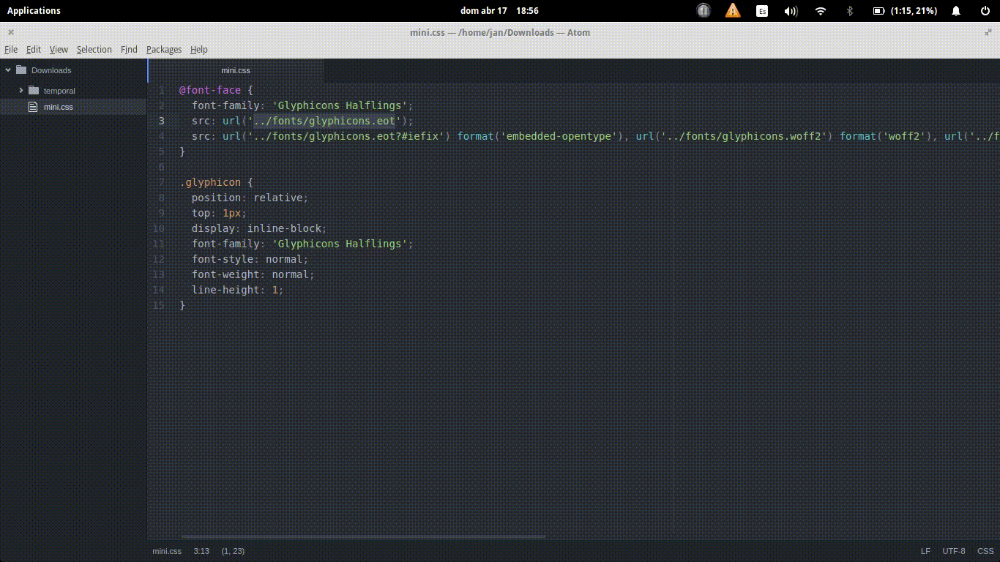

# mywt
my first webtask

Set a version to the `url` attribute of css files. Essential for when working with CDN.

# Install

```
npm install -d
```

# How to use

## Running the express server

```
npm start
```

## Webpage

```
http://localhost:3000/
```





# Url WebTask

Verb: **POST**  
parameter: `css`

[https://webtask.it.auth0.com/api/run/wt-joejansanchez-gmail_com-0/wt-css?webtask_no_cache=1](https://webtask.it.auth0.com/api/run/wt-joejansanchez-gmail_com-0/wt-css?webtask_no_cache=1)!
